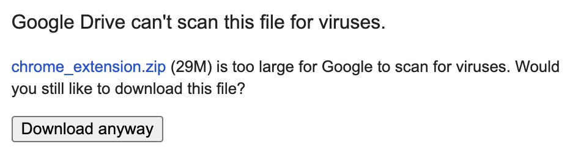

# BullyProof 📵

A chrome extension that allows users to filter out hate speech on social media.

# Installation Instructions 🚀
1. [Download the extension](https://drive.google.com/uc?export=download&id=1i4mABpO5c6TGZF17FDouAGc5ptxkcrIe)
   
   </img>

   Click on `Download anyway` (it is safe 😊)

2. Unzip the downloaded zip file.
3. Open chrome browser and copy paste the following link:
```
chrome://extensions/
```
1. Click on `Load unpacked` on the top left-hand corner.
   
</img>

5. Select the folder you just extracted.
6. Congratulations 🥳 you have now installed BullyProof! You are one step closer to improving your social media experience.

   
